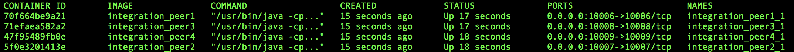

# BlockChain
### Af Andreas Heindorff Larsen og Emil Pilgaard

## teknologier ##
Vores Blockchain er bygget i Java med Maven.

Vi har en docker-compose fil som er sat til at starte 4 noder af vores Java program op.

Vi vil bruge telnet til at interagere med vores blockchain.

For at køre systemet skal du derfor have installeret følgende:

* Java
* Maven
* Docker
* telnet

## Setup ##
For at starte de fire noder op skal der køres denne komando

`sh run.sh` 

Herefter vil der blive startet fire noder op som vil køre localhost og vil benytte port 10006-10009

## Connect ##

For at se de kørende containere kan følgende kommando køres

`docker ps`

Dette vil producere et resultat der ligner dette

Vi kan derefter køre denne komando for at komme ind i en af containerne 

`sudo docker exec -i -t <Container name> /bin/bash`
