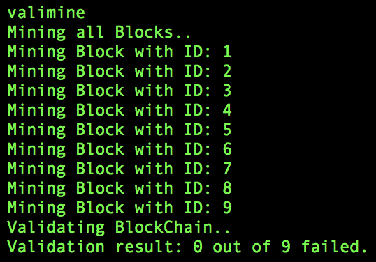
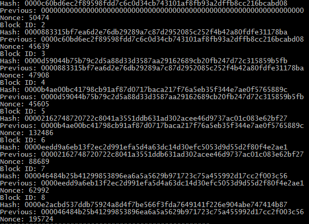
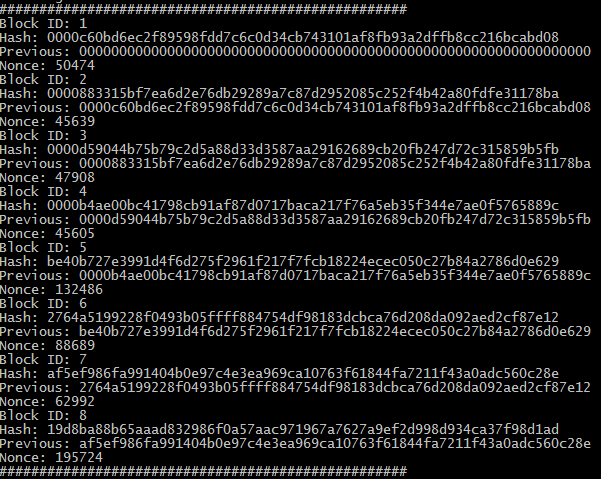

# BlockChain
### Af Andreas Heindorff Larsen og Emil Pilgaard

## teknologier ##
Vores Blockchain er bygget i Java med Maven.  
Den er struktureret så ledes at hver block kan holde 5 Transaktionsobjekter. Hvis man forsøger at tilføje en transaktion til blockchainen, og den sidste Block allerede holder på 5, så vil der blive oprettet en ny block til at holde transaktionen.
Disse transaktionsobjekter indeholder et beløb, modtager og afsender.

Vi har en docker-compose fil som er sat til at starte 4 noder af vores Java program op.

Vi vil bruge telnet til at interagere med vores blockchain.

For at køre systemet skal du derfor have installeret følgende:

* Java
* Maven
* Docker
* telnet

## Setup ##
For at starte de fire noder op skal der køres denne komando

`sh run.sh` 

Herefter vil der blive startet fire noder op som vil køre localhost og vil benytte port 10006-10009

## Connect ##

For at se de kørende containere kan følgende kommando køres

`docker ps`

Dette vil producere et resultat der ligner dette

For at få adgang til en af noderne kan du køre følgende komando, her tilslutter vi til den der har port 10006
og i en anden fane kan vi åbne til noden på port 10008

`telnet localhost 10006`
`telnet localhost 10008`

## komandoer ##

Når vi har fået adgang til en node kan vi start med at skrive `help`, dette vil vise os en liste af komandoer der er mulige at udføre

Nu kan vi i den fane der har port 10008 åben skrive `view`

Herefter kan vi prøve `add` i den fane der køre med port 10006

derefter skal vi skrive et beløb til fra hvem og til hvem.

Vi kan skrive `consult`, som vil vise hvor mange ændringer de forskellige noder har

så kan vi skrive `update_peers` for at sende vores ændringer til de andre

Hvis vi går tilbage til fanen med port 10008 og skriver `update` og derefter skriver `view` kan vi se at der nu er 9 blocks.

Vi kan også prøve at skrive `valimine` dette vil mine og validere alle blocks i vores blockchain

For at få BlockChainen til at overholde en consensus algoritm, kan validate kommandoen bruges til at se hvilke blocks der overholder algoritmen, og hvilke der ikke gør.  
`Valimine` kommandoen vil mine alle blocks i blockchainen, og `mine` kommandoen vil bruges til at mine én specifik block.  
Algoritmen gør det let at se med det blotte øje når der bliver foretaget en ændring i en BlockChain, da hash værdierne vil blive opdateret, så de ikke længere indeholder "0000" i starten af hashen.  

Her er BlockChainen, uden nogle ændringer, efter den er blevet minet:  
  
  
  
Hvis vi så bruger `edit` kommandoen, og ændrer i en transaktion, kan vi se at algoritmen viser at der er fejl i de blocks, der ikke starter med 0000.  
  
  

## Referencer ##

https://stackoverflow.com/questions/33021084/how-to-handle-ip-addresses-when-linking-docker-containers-with-each-other-using  
https://www.igvita.com/2014/05/05/minimum-viable-block-chain/  
https://anders.com/blockchain/  
https://youtu.be/_160oMzblY8  
https://docs.oracle.com/javase/7/docs/api/java/net/Socket.html  
https://docs.oracle.com/javase/7/docs/api/java/io/BufferedReader.html  
https://docs.oracle.com/javase/7/docs/api/java/io/PrintWriter.html  
https://www.youtube.com/watch?v=baJYhYsHkLM  
